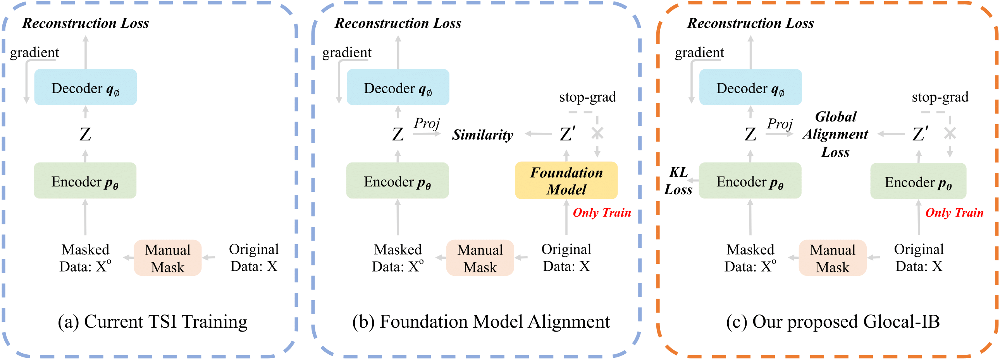

# Glocal-IB: Global-Local Information Bottleneck for Time Series Imputation

[](https://www.python.org/downloads/) [](https://pytorch.org/) [](LICENSE)


##  🥰 Accepted in NeurIPS 2025 [NeurIPS]([NeurIPS Poster Glocal Information Bottleneck for Time Series Imputation](https://neurips.cc/virtual/2025/poster/116239))


### **Arxiv is coming soon**


## 📋 Table of Contents

- [Overview](#overview)
- [Features](#features)
- [Installation](#installation)
- [Quick Start](#quick-start)
- [Usage](#usage)
- [Model Architecture](#model-architecture)
- [Supported Models](#supported-models)
- [Datasets](#datasets)
- [Configuration](#configuration)
- [Results](#results)
- [Examples](#examples)
- [Contributing](#contributing)
- [Citation](#citation)
- [License](#license)


## 🎯 Overview

Glocal-IB is a novel framework for time series imputation that combines global and local information through an Information Bottleneck approach. The framework wraps existing imputation models and enhances them with alignment loss to improve imputation quality by learning better representations of both masked and complete time series data. Moreover, it solves the optimization dilemma in current time series imputation methods.




### Key Innovation

- **Global-Local Alignment**: Aligns latent embeddings between masked and complete time series data
- **Information Bottleneck**: Preserves essential information while reducing redundancy
- **Model Agnostic**: Can wrap any existing time series imputation model
- **Flexible Loss Functions**: Supports multiple alignment loss types (contrastive, cosine alignment, foundation model alignment)


## ✨ Features

- 🔄 **Model Wrapper**: Seamlessly integrates with existing imputation models
- 🎯 **Alignment Loss**: Multiple loss types for embedding alignment
- 📊 **Comprehensive Evaluation**: Support for various metrics (MAE, MSE)
- 🚀 **Easy to Use**: Simple API for training and inference
- 📈 **Scalable**: Supports both small and large-scale time series datasets
- 🔧 **Configurable**: Extensive hyperparameter configuration options


## 🛠️ Installation

### Prerequisites

- Python 3.8+
- PyTorch 1.9+
- CUDA (optional, for GPU acceleration)

### Install Dependencies

```bash
# Clone the repository
git clone https://github.com/your-username/Glocal-IB.git
cd Glocal-IB

# Create conda environment
conda create -n gib python=3.10
conda activate gib

# Install PyTorch (adjust based on your CUDA version)
pip install torch==2.6.0 torchvision==0.21.0 torchaudio==2.6.0 --index-url https://download.pytorch.org/whl/cu118

# Install other dependencies
pip install -r requirements.txt
```


## 🚀 Quick Start for Your Own Model

### Basic Usage: Running the Demo Notebook

**Open and run `Glocal_IB_EN.ipynb` for the English version or `Glocal_IB_ZH.ipynb` for the Chinese version.**


## 📖 Usage of Our Code

### Training a Model

```bash
# Basic training command
python train_EN.py --dataset ETTh1 --model SAITS --missing_rate 0.1 --epochs 30

# With custom alignment settings
python train_EN.py \
    --dataset ETTh1 \
    --model SAITS \
    --missing_rate 0.1 \
    --epochs 30 \
    --align_type cos_align \
    --align_weight 0.5 \
    --save_res 1 \
    --csv_path ./results/results.csv
```

### Batch Training with Scripts

```bash
# Run batch training script
bash script/train_bash.sh
```

### Command Line Arguments

#### Dataset Settings

- `--dataset`: Dataset name (ETTh1, ETTh2, ETTm1, ETTm2, etc.)
- `--pattern`: Missing pattern (point, subseq, block)
- `--missing_rate`: Missing rate (0.1-0.9)
- `--n_steps`: Number of time steps

#### Training Settings
- `--epochs`: Training epochs
- `--batch_size`: Batch size
- `--seed`: Random seed
- `--save_emb`: Save embeddings (0/1)
- `--save_res`: Save results (0/1)
- `--csv_path`: Path to save CSV results

#### Glocal-IB Settings
- `--align_type`: Alignment loss type (contras_1, contras_2, FM_align)
- `--align_weight`: Alignment loss weight
- `--mse_weight`: MSE loss weight
- `--kl_weight`: KL divergence loss weight

#### Model Settings
- `--model`: Model name (SAITS, Transformer, DLinear, TimesNet, etc.)
- `--d_model`: Embedding dimension
- `--n_layers`: Number of layers
- `--n_heads`: Number of attention heads
- `--dropout`: Dropout rate

### Key Components

1. **Base Model**: Any time series imputation model (SAITS, Transformer, etc.)
2. **Embedding Extractor**: Extracts intermediate representations
3. **Alignment Module**: Computes alignment loss between masked and complete embeddings
4. **Loss Combination**: Combines reconstruction and alignment losses


## 🤖 Supported Models

### PyPOTS Models
- **SAITS**: Self-Attention-based Imputation for Time Series
- **Transformer**: Standard Transformer for imputation
- **DLinear**: Linear model with decomposition
- **TimesNet**: TimesNet for time series forecasting/imputation
- **FreTS**: Frequency-aware Time Series
- **PatchTST**: Patch-based Time Series Transformer
- **SCINet**: Sample Convolution and Interaction Network
- **iTransformer**: Inverted Transformer
- **CSDI**: Conditional Score-based Diffusion model
- **GPVAE**: Gaussian Process Variational Autoencoder
- **TimeMixer**: Time Mixer model
- **USGAN**: Unsupervised GAN for imputation

### Custom Models
- **saits_my**: Custom SAITS implementation
- **timesnet_my**: Custom TimesNet implementation
- **gpvae_my**: Custom GPVAE implementation
- **dlinear_my**: Custom DLinear implementation
- **tcn_my**: Custom TCN implementation


## 📊 Datasets

The framework supports various time series datasets:

### Time Series Forecasting
- **ETTh1, ETTh2**: Electricity Transformer Temperature (Hourly)
- **ETTm1, ETTm2**: Electricity Transformer Temperature (Minutely)

### Traffic Datasets
- **PEMS-BAY**: Traffic speed data
- **METR-LA**: Traffic flow data
- **PEMS-TRAFFIC**: Traffic volume data

### Other Datasets
- **Beijing Air Quality**: Air quality measurements
- **Electricity**: Electricity consumption
- **Weather**: Weather data
- **Illness**: Disease cases
- **Exchange Rate**: Currency exchange rates


## ⚙️ Configuration

### Example Configuration

```python
# Hyperparameters
config = {
    # Dataset settings
    "dataset": "ETTh1",
    "missing_rate": 0.1,
    "pattern": "point",
    "n_steps": 96,
    
    # Model settings
    "model": "SAITS",
    "d_model": 256,
    "n_layers": 2,
    "n_heads": 4,
    "dropout": 0.1,
    
    # Training settings
    "epochs": 30,
    "batch_size": 32,
    "learning_rate": 0.001,
    
    # Glocal-IB settings
    "align_type": "cos_align",
    "align_weight": 0.5,
    "mse_weight": 1.0,
    "kl_weight": 1e-6,
}
```


### Key Findings

- **Consistent Improvement**: Glocal-IB consistently improves imputation quality across different models and datasets
- **Robust to Missing Rates**: Performance improvements are maintained across various missing rates (0.1-0.9)
- **Pattern Agnostic**: Works well with different missing patterns (point, subsequence, block)


## 💡 Examples

### Custom Model Integration

```python
import torch.nn as nn
from Glocal_IB import Glocal_IB

class MyImputationModel(nn.Module):
    def __init__(self, input_dim, hidden_dim):
        super().__init__()
        self.encoder = nn.Linear(input_dim, hidden_dim)
        self.decoder = nn.Linear(hidden_dim, input_dim)
    
    def forward(self, x):
        embedding = self.encoder(x)
        output = self.decoder(embedding)
        return output, embedding  # Return both output and embedding

# Wrap your custom model
base_model = MyImputationModel(input_dim=10, hidden_dim=64)
glocal_model = Glocal_IB(
    base_model=base_model,
    embedding_dim=64,
    align_loss_type="cos_align",
    align_weight=0.5
)
```

### Evaluation

```python
# Evaluate model performance
def evaluate_model(model, test_data, test_mask):
    model.eval()
    with torch.no_grad():
        imputation = model(test_data)
        
        # Calculate metrics only on artificially missing positions
        mae = F.l1_loss(imputation[test_mask], test_data[test_mask])
        mse = F.mse_loss(imputation[test_mask], test_data[test_mask])
        
    return mae.item(), mse.item()
```


## 🤝 Contributing

We welcome contributions! 

### Development Setup

```bash
# Fork and clone the repository
git clone https://github.com/your-username/Glocal-IB.git
cd Glocal-IB

# Install in development mode
pip install -e .
```

### Submitting Changes

1. Fork the repository
2. Create a feature branch (`git checkout -b feature/amazing-feature`)
3. Commit your changes (`git commit -m 'Add amazing feature'`)
4. Push to the branch (`git push origin feature/amazing-feature`)
5. Open a Pull Request


## 📚 Citation

If you use this code in your research, please cite our paper:

```bibtex

```


## 🙏 Acknowledgments

- [PyPOTS](https://github.com/WenjieDu/PyPOTS) for providing the base imputation models
- [PyGrinder](https://github.com/WenjieDu/PyGrinder) for missing data generation utilities
- The time series community for valuable datasets and benchmarks


---

⭐ **Star this repository if you find it helpful!**
